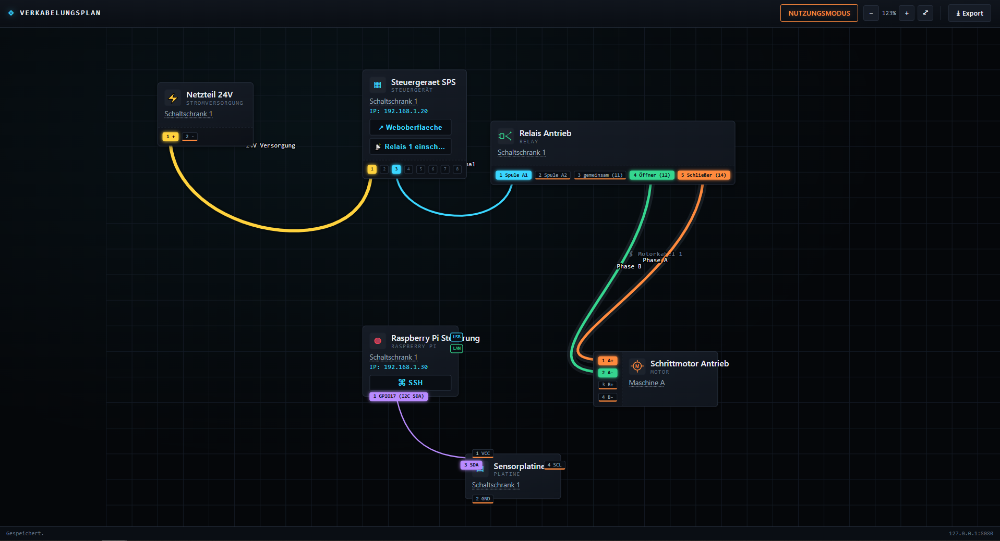

# Verkabelungsplan



**Aktuelle Version: 3.3.0** – siehe [CHANGELOG.md](CHANGELOG.md) für alle
Änderungen.

Ein lokal laufender Webserver, der einen interaktiven Verkabelungsplan
bereitstellt (frei platzierbare Elemente wie Stromversorgung, Batterie,
Motor, Antrieb, Platine, Steuergerät, Klemmleiste, Delay, Raspberry Pi,
Kamera, Router, Ethernet Switch, Relay, Schalter, Taster, Poti usw.,
verbunden durch farbige Leitungen, optional zu Kabel-Bündeln
zusammengefasst). Erreichbar unter der IP des Rechners im lokalen Netzwerk.
Dark-Theme im Stil von Anduril Lattice, Verbindungslinien im Stil von
harness.design (weiche Kurven, senkrechter Austritt an Ports/Pins). Der
Plan lässt sich als PDF (Querformat, dunkler oder heller Hintergrund, mit
exakt derselben Leitungsführung wie in der Webansicht) sowie als Netzliste
(CSV-Tabelle aller Verbindungen) exportieren. Element-Schaltflächen können
neben Web/RDP/VNC/SSH auch MQTT-Nachrichten versenden.

## 1. Benötigte Python-Pakete

Python 3.10+ wird empfohlen. Installation der Pakete:

```bash
pip install -r requirements.txt
```

entspricht:

```bash
pip install Flask==3.0.3
pip install reportlab==4.2.5
pip install paho-mqtt==2.1.0
pip install pyinstaller==6.10.0
```

- **Flask** – der Webserver, der die Oberfläche ausliefert und die
  Konfiguration per REST-API speichert/lädt.
- **reportlab** – erzeugt den PDF-Export (Querformat, dunkler/heller
  Hintergrund). Fehlt das Paket, läuft das Programm trotzdem, der
  PDF-Export-Button liefert dann nur eine verständliche Fehlermeldung
  (der CSV-Netzlisten-Export funktioniert unabhängig davon immer, da er
  nur die Python-Standardbibliothek benötigt).
- **paho-mqtt** – wird für Element-Schaltflächen mit `mqtt://`-Adresse
  benötigt (sendet beim Klick eine MQTT-Nachricht). Fehlt das Paket,
  liefert eine solche Schaltfläche eine verständliche Fehlermeldung statt
  eines Absturzes; alle anderen Funktionen bleiben unberührt.
- **PyInstaller** – zum Erzeugen der eigenständigen `.exe`.

Alles andere (HTML/CSS/JS) läuft im Browser des Nutzers, es sind keine
weiteren Pakete nötig.

## 2. Programm direkt starten (zum Testen)

```bash
python app.py
```

Danach ist die Oberfläche erreichbar unter:

- `http://127.0.0.1:8080` (lokal)
- `http://<IP-des-PCs>:8080` (im Netzwerk – die genaue IP wird beim Start
  in der Konsole ausgegeben)

Der Port lässt sich in `config.json` unter `server.port` ändern.

## 3. Ordnerstruktur

```
netzwerkplan/
├── app.py              Flask-Server
├── config.json          Konfiguration (Ansicht, Elemente, Verbindungen)
├── requirements.txt
├── templates/
│   └── index.html
└── static/
    ├── style.css
    └── app.js
```

## 4. Automatischer Build per GitHub Actions (empfohlen)

Dieses Repository enthält bereits den Workflow
`.github/workflows/build-exe.yml`. Er baut automatisch **sowohl eine
Windows-`.exe`** (auf einem Windows-Runner) **als auch eine ausführbare
Datei für macOS** (auf einem macOS-Runner) – parallel, in einem einzigen
Workflow-Lauf. Es muss also weder ein Windows- noch ein Mac-Rechner lokal
vorhanden sein.

**Vorgehen:**

1. Repository-Inhalt (alle Dateien und Ordner dieses Projekts,
   inklusive `.github/`) in ein neues GitHub-Repository pushen:
   ```bash
   git init
   git add .
   git commit -m "Verkabelungsplan"
   git branch -M main
   git remote add origin https://github.com/<dein-benutzername>/<dein-repo>.git
   git push -u origin main
   ```
2. Der Workflow startet automatisch beim Push auf `main` (auch manuell
   auslösbar über den Reiter **Actions → Build Windows EXE + macOS App →
   Run workflow**).
3. Nach ca. 2–4 Minuten sind die Builds unter **Actions → [letzter Lauf] →
   Artifacts** als ZIP herunterladbar:
   - **Verkabelungsplan-Windows** – enthält `Verkabelungsplan.exe`, `config.json`
     und `README.md`.
   - **Verkabelungsplan-macOS** – enthält die ausführbare Datei
     `Verkabelungsplan` (ohne Dateiendung), `config.json` und `README.md`.
4. Für ein richtiges GitHub **Release** (dauerhafte Download-Links für
   beide Plattformen) zusätzlich einen Tag pushen, z. B.:
   ```bash
   git tag v1.0.0
   git push origin v1.0.0
   ```
   Der Workflow wartet dann, bis **beide** Builds fertig sind, und
   erstellt automatisch ein Release mit `Verkabelungsplan-Windows.exe`,
   `Verkabelungsplan-macOS`, `config.json` und `README.md` als Anhang.

Der Workflow benötigt keine zusätzlichen GitHub Secrets – `GITHUB_TOKEN`
wird von GitHub Actions automatisch bereitgestellt.

### Hinweis zur Nutzung der macOS-Datei

Macs blockieren unsignierte, aus dem Internet heruntergeladene Programme
standardmäßig (Gatekeeper). Nach dem Download der Datei `Verkabelungsplan`:

```bash
chmod +x Verkabelungsplan
xattr -d com.apple.quarantine Verkabelungsplan   # Download-Sperre entfernen
./Verkabelungsplan
```

Alternativ: Rechtsklick auf die Datei im Finder → **Öffnen** → im
Warnhinweis erneut **Öffnen** bestätigen. Die `config.json` muss dabei im
selben Ordner wie die Datei `Verkabelungsplan` liegen.

## 4b. Alternative: manueller Build mit PyInstaller

Im Projektordner (dort, wo `app.py` liegt) folgenden Befehl ausführen:

**Windows (cmd/PowerShell):**

```bash
pyinstaller --onefile --name Verkabelungsplan --add-data "templates;templates" --add-data "static;static" app.py
```

**macOS/Linux** (Trennzeichen `:` statt `;`):

```bash
pyinstaller --onefile --name Verkabelungsplan --add-data "templates:templates" --add-data "static:static" app.py
```

Optional ohne Konsolenfenster (Windows, `pythonw`-Stil, IP/Status werden dann
nicht angezeigt – daher nur empfohlen, wenn das nicht benötigt wird):

```bash
pyinstaller --onefile --noconsole --name Verkabelungsplan --add-data "templates;templates" --add-data "static;static" app.py
```

Nach dem Build liegt die fertige Datei unter `dist/Verkabelungsplan.exe`.

## 5. Wichtig: config.json neben die exe legen

Beim ersten Start erzeugt das Programm automatisch eine `config.json` im
selben Verzeichnis wie die exe, falls noch keine vorhanden ist. Soll eine
vorbereitete Konfiguration (z. B. die hier mitgelieferte `config.json` mit
Beispielelementen) verwendet werden, einfach diese Datei manuell in
denselben Ordner wie `Verkabelungsplan.exe` kopieren, bevor die exe gestartet
wird.

Die `config.json` ist reines, menschenlesbares JSON und enthält:

- `server` – Host/Port des Webservers
- `view` – Ansichtseinstellungen (Zoom, Position, Rasteranzeige, Einrasten,
  Rastergröße)
- `mode` – zuletzt aktiver Modus (`edit`/`use`)
- `elements` – alle platzierten Netzwerk-Elemente (Name, Ort, Typ,
  Position, verknüpfte Webseiten)
- `connections` – alle Verbindungen zwischen Elementen (Farbe, Stärke,
  Bezeichnung)

Sie kann bei Bedarf auch von Hand in einem Texteditor angepasst werden,
solange gültiges JSON erhalten bleibt.

## 6. Bedienung

- **Bearbeitungsmodus** (oben links umschaltbar): Elemente aus der Palette
  hinzufügen, per Drag & Drop verschieben (mit Raster/Einrasten), über den
  Stift-Button (✎) Name/Ort/Typ/Webseiten bearbeiten, über „Verbindung"
  zwei Elemente bzw. bei Elementen mit Anschlüssen (Steuergerät,
  Klemmleiste, Router, Ethernet Switch, Relay, Motor, Stromversorgung,
  Batterie, Platine, Raspberry Pi, Schalter/Taster/Poti, …) zwei konkrete
  Anschlüsse nacheinander anklicken, um eine farbige Linie zu ziehen
  (Farbe/Stärke/Bezeichnung/Kabel-Zugehörigkeit im Klick auf die Linie
  einstellbar). Anschlüsse heißen bei den meisten Elementen **Pins**; nur
  bei echten Netzwerkgeräten (Router, Ethernet Switch) bleibt es bei
  **Ports**. Die Elementgröße wächst automatisch mit der Anzahl der
  Anschlüsse (z. B. wird eine Klemmleiste mit 24 Ports spürbar breiter),
  damit sie nie gequetscht wirken – bei Ports oben/unten wächst die
  Breite, bei Ports links/rechts die Höhe.
  Bei Elementen mit gemeinsamem Anschluss-Riegel (Steuergerät,
  Klemmleiste, Router, Ethernet Switch, Relay, Motor, Stromversorgung,
  Batterie, Schalter/Taster/Poti) lassen sich die Anschlüsse über die
  Buttons „⟳" (Seite drehen) und „⇋" (Reihenfolge spiegeln) am Element
  ausrichten. Doppelklick auf einen einzelnen Anschluss vergibt einen
  eigenen Namen (zusätzlich zur Nummer); alle Namen lassen sich auch
  gesammelt im Element-Dialog bearbeiten. Bei der **Klemmleiste**
  erscheinen die Anschlüsse automatisch auf zwei gegenüberliegenden
  Seiten mit identischer Nummerierung und identischen Namen (Vorder-/
  Rückseite); Verbindungen lassen sich unabhängig an der einen oder
  anderen Seite andocken. Bei **Platine** und **Raspberry Pi** lässt sich
  jeder Pin einzeln über „+ Anschluss hinzufügen" ergänzen und
  individuell einer Seite (oben/unten/links/rechts) zuweisen – beim
  Raspberry Pi zusätzlich mit Art-Auswahl Pin/USB/LAN. Der „⟳"-Button am
  Element dreht dabei alle so platzierten Pins gemeinsam um eine Seite
  weiter, ohne jeden einzeln im Dialog umstellen zu müssen.
- **Relay**: Kontaktart im Element-Dialog wählbar (Schließer/Öffner/
  Wechsler) – die passende Pin-Anzahl (inkl. 2 Spulen-Pins) wird
  automatisch gesetzt, das Anzeigebild zeigt das passende Schaltplan-
  Symbol.
- **Motor**: Bauart im Element-Dialog wählbar (Gleich-/Wechselstrommotor,
  bürstenloser Motor/BLDC, Schrittmotor) – Pin-Anzahl und Anzeigebild
  passen sich automatisch an.
- **Kabel-Bündel**: Mehrere Verbindungen (z. B. alle Adern eines
  Motorkabels) lassen sich im Verbindungs-Dialog über das Feld
  „Kabel-Bündel" einem gemeinsamen Kabel zuordnen (bestehendes Kabel
  wählen oder „+ Neues Kabel…"). Verbindungen im selben Kabel werden mit
  einer gemeinsamen Kabel-Hülle plus Kabel-Namen dargestellt – in der
  Webansicht wie im PDF-Export.
- **Mehrere Elemente gemeinsam verschieben:** Im Bearbeitungsmodus bei
  gehaltener Umschalttaste (Shift) auf leerer Fläche ziehen, um einen
  Auswahlrahmen aufzuziehen. Alle berührten Elemente werden markiert
  (orange Umrandung) – anschließend an einem davon ziehen, um alle
  markierten Elemente parallel zu verschieben. Verbindungen zwischen
  zwei markierten Elementen (inkl. ihrer Wegpunkte und
  Bezeichnungs-Position) werden dabei exakt mitverschoben, sodass ihre
  Form erhalten bleibt. Klick auf leere Fläche ohne Shift oder Escape
  hebt die Auswahl wieder auf.
- **Hervorhebung nach Standort:** Klick auf die Standort-Angabe eines
  Elements hebt – wie bei Leitungen – alle Elemente mit demselben
  Standort hervor und dimmt die übrigen ab. Erneuter Klick, Klick auf
  leere Fläche oder Escape heben die Hervorhebung wieder auf
  (funktioniert im Bearbeitungs- und im Nutzungsmodus). Das Ortsfeld im
  Element-Dialog schlägt bereits verwendete Standorte sowie ein paar
  generische Vorschläge (z. B. „Schaltschrank 1") vor.
- **Leitungen bearbeiten:** Jede Leitung zeigt im Bearbeitungsmodus einen
  eigenen „✎"-Button (wie an den Elementen), der ein Menü öffnet, um die
  Bezeichnung zu ändern, die Farbe anzupassen, einen Wegpunkt an dieser
  Stelle einzufügen oder die Leitung einzeln zu entfernen. Ein Klick auf
  die Leitung selbst öffnet direkt den vollständigen Dialog mit
  zusätzlicher Einstellung für die Leitungsstärke, Kabel-Zugehörigkeit
  und „Linie zurücksetzen" (entfernt alle Wegpunkte auf einmal).
- **Leitungsführung:** Leitungen verlaufen als weiche Kurve und treten an
  einem konkreten Port/Pin immer senkrecht zur jeweiligen Anschlussseite
  aus, bevor sie sich zur nächsten Station biegen ("Anti-Verknoten"-
  Verhalten). Über „+ Wegpunkt hier" lässt sich der Verlauf jederzeit
  manuell feinjustieren (siehe unten).
- **Leitungen umlegen:** Über „+ Wegpunkt hier" im Kontextmenü lassen sich
  frei verschiebbare Wegpunkte setzen, um die Leitung gezielt um andere
  Elemente herumzuführen (weiche, fließende Kurve). Jeder Wegpunkt hat
  einen eigenen „✕"-Button zum Entfernen direkt daneben.
- **Bezeichnung platzieren:** Eine gesetzte Bezeichnung lässt sich per
  Ziehen frei verschieben (mit gestrichelter Führungslinie zur Leitung,
  wenn sie weiter weg gesetzt wird).
- **Mehrere Webseiten/Aktionen je Element:** Im Element-Dialog lassen sich
  beliebig viele Aktionen mit eigener Bezeichnung hinterlegen („+
  Webseite/Aktion hinzufügen"). Jede erscheint als eigene, benannte
  Schaltfläche direkt auf dem Element (z. B. „↗ Admin-Oberfläche", „↗
  Grafana"). Über die Protokoll-Schnellauswahl lassen sich auch
  Schaltflächen für RDP, VNC, SSH oder **MQTT** anlegen: Ein Klick auf
  eine RDP-Schaltfläche lädt eine `.rdp`-Datei mit der passenden Ziel-IP
  herunter; deren Öffnen startet die Windows-Remotedesktopverbindung
  automatisch mit vorausgefüllter Adresse. Bei `mqtt://` (z. B.
  „mqtt://192.168.1.5:1883") erscheinen zusätzliche Felder für Topic und
  Payload – ein Klick sendet dann über den Server eine MQTT-Nachricht an
  den angegebenen Broker (setzt das Paket `paho-mqtt` voraus, siehe
  Abschnitt 1).
- **Nutzungsmodus**: Keine Änderungen möglich, es können ausschließlich
  über die Schaltflächen auf jedem Element die hinterlegten Aktionen
  ausgelöst werden. Ein Klick auf eine Leitung hebt sie vollständig
  hervor (andere Leitungen werden abgedunkelt) – erneuter Klick oder
  Klick auf leere Fläche hebt die Hervorhebung wieder auf.
- **Zoom/Pan**: Mausrad zum Zoomen, Ziehen auf leerer Fläche zum Verschieben
  der Ansicht, +/−/⤢ oben rechts als Alternative.
- **IP-Anzeige:** Jedes Element zeigt automatisch die aus der ersten
  hinterlegten Webseite extrahierte IP-Adresse bzw. den Hostnamen direkt
  auf der Karte an (z. B. „IP: 192.168.1.2").
- **Speichern**: Über den Button „Speichern" oder automatisch nach jeder
  Änderung (Elemente, Verbindungen) sowie leicht verzögert nach Zoom/Pan.
- **Export** (Button „⭳ Export", oben rechts – sowohl im Bearbeitungs- als
  auch im Nutzungsmodus verfügbar): Öffnet ein Fenster mit drei
  Export-Möglichkeiten:
  - **PDF, dunkler Hintergrund** und **PDF, heller Hintergrund** – der
    komplette Plan wird automatisch im **Querformat** auf eine Seite
    eingepasst, mit exakt derselben Leitungsführung (Kurvenverlauf) wie
    in der Webansicht (Elemente, Pins/Ports, farbige Leitungen inkl.
    Wegpunkte, Kabel-Bündel und Bezeichnungen).
  - **Netzliste (CSV)** – eine Tabelle aller Verbindungen mit
    Von/Von-Typ/Von-Ort/Von-Anschluss, Nach/Nach-Typ/Nach-Ort/
    Nach-Anschluss, Farbe, Stärke, Bezeichnung und Kabel-Zugehörigkeit,
    die sich direkt in Excel & Co. öffnen lässt.

  Beide Export-Formate berücksichtigen immer den **aktuell im Browser
  angezeigten Stand** – auch noch nicht gespeicherte Änderungen sind
  enthalten, ein vorheriges „Speichern" ist also nicht nötig.
